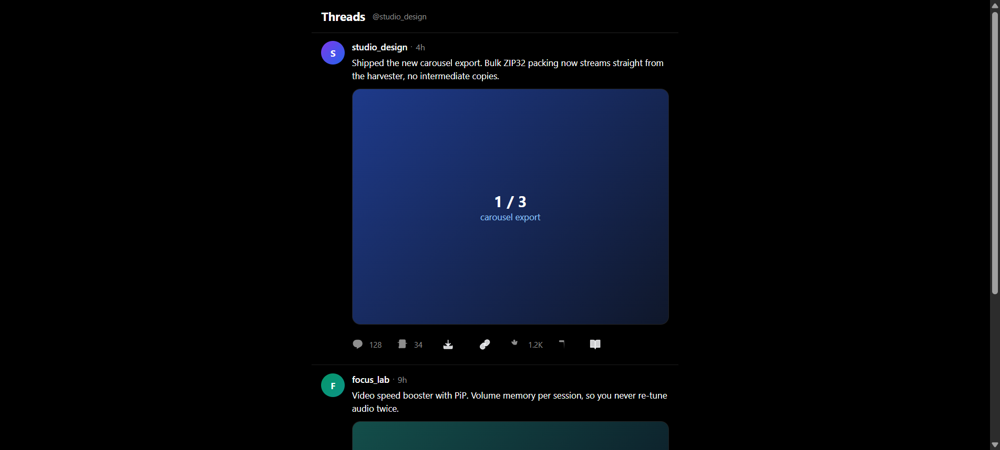

<div align="center">

# ⚡ ThreadMax <sub>v1.4.0</sub>

**Precision Media Downloader, Native Video Booster, Thread Unroller & Composer Toolkit for Threads Web**

*Anti-Slop Minimal Precision / Zero Dependencies / In-Memory ZIP32 / 100% Client-Side Privacy*  
*Engineered for [threads.net](https://www.threads.net/) & [threads.com](https://www.threads.com/)*

[](https://github.com/Stxyu-p/threadmax)
[](https://www.threads.net/)
[](LICENSE)


</div>

---

## 📸 Interface Preview

<p align="center">
  
</p>

---

## ⚡ Core Pillars & Capabilities

| Capability | Module | What It Does | Technical Advantage |
| :--- | :---: | :--- | :--- |
| **In-Feed Action Trigger** | 📥 | Injects a discrete 5th action icon directly beside Like, Comment, Repost, and Share. | Zero layout shift; auto-detects media type and adjusts dropdown context. |
| **In-Memory ZIP32 Compiler** | 📦 | Compresses multi-slide carousels into a single `.zip` archive on the fly. | Zero external libraries (no JSZip); uses pre-computed CRC32 table for instant compression. |
| **Video Player Booster** | 🎬 | Floating overlay controller with cycle playback speed (**1.0x → 1.25x → 1.5x → 2.0x**), **PiP**, and volume memory. | Pure DOM binding to `HTMLVideoElement`; automatically persists volume to avoid audio shock. |
| **Clean Link Sanitizer** | 🔗 | 1-Click URL copy that strips Meta tracking junk (`?xmt=`, `?s=`, etc.). | Exports pristine canonical URLs `https://www.threads.net/@user/post/id`. |
| **Smart Timestamps** | ⏱️ | Formats relative timestamps into **Hybrid** (`2h (14:30)`), **Absolute**, or **Native**. | Parses `<time datetime="...">` ISO strings into localized machine time. |
| **Thread Unroller** | 📖 | Collects long author threads (1/N, 2/N) into a unified modal reader with **1-Click Markdown Export**. | Eliminates feed noise and provides clean copy for Obsidian and Notion. |
| **Composer Hook Guide** | ✍️ | Renders a subtle hairline marker inside the composer indicating the 180-char mobile cutoff. | Visual feedback ensures key hooks never get hidden behind `...more`. |
| **1-Click Thread Splitter** | ✂️ | Automatically chunks texts >500 characters into numbered `1/N` segments with sentence preservation. | Pre-fills reply boxes sequentially without manual copy-pasting. |

---

## 🔬 Under the Hood: Engineering Invariants

### 1. Meta Virtualized DOM & Stacking Context Breakout

Threads Web aggressively recycles DOM nodes and traps popups within constrained `overflow: hidden` bounding boxes. ThreadMax implements an **Out-of-Flow Stacking Portal**:
- Action dropdowns and modals escape parent CSS stacking contexts (`z-index: 9999`).
- Viewport bounds checking prevents clipping at the edges of the screen.
- Active listeners auto-dismiss on scroll or external pointer clicks.

### 2. Pure Client-Side ZIP32 Engine

Traditional browser downloaders rely on bulky multi-megabyte dependencies like JSZip. ThreadMax incorporates an ultra-lightweight ZIP32 packager:
- **Pre-computed 256-entry CRC32 table** generates checksums with bitwise speed.
- In-memory `Uint8Array` binary builder streams headers, file data, and central directory records directly to `Blob`.
- Memory footprint remains strictly bounded to active media asset size (<30MB RSS).

---

## 🚀 Installation & Setup

1. Install a userscript manager in your browser:
   - [Tampermonkey](https://www.tampermonkey.net/) (Recommended)
   - [Violentmonkey](https://violentmonkey.github.io/)
2. Install **ThreadMax**:
   - Install directly via GitHub Raw:  
     👉 **[Install threadmax.user.js](https://raw.githubusercontent.com/Stxyu-p/threadmax/main/threadmax.user.js)**
3. Navigate to [threads.net](https://www.threads.net/) or [threads.com](https://www.threads.com/) - the ⬇ download trigger appears inline on every post with media.

---

## ⚙️ Configuration

Customize via the Tampermonkey menu:

| Setting | Options | Default |
| :--- | :--- | :--- |
| **Download Mode** | Stored ZIP (`.zip`) / Individual Files | `Stored ZIP` |
| **Timestamp Mode** | `Hybrid` / `Absolute` / `Native` | `Hybrid` |
| **Video Speed** | `1.0x` / `1.25x` / `1.5x` / `2.0x` | `1.0x` |

---

## ♿ Accessibility Contract

The injected controls are keyboard-first, not mouse-only:

| Control | Keyboard behavior |
| :--- | :--- |
| Injected action buttons | `role="button"` + `tabindex="0"`, activate on **Enter** and **Space** |
| Reader and Splitter modals | `role="dialog"` + `aria-modal`, **Tab** and **Shift+Tab** stay trapped inside, **Esc** closes, focus returns to the opener |
| Video controller | `role="group"` with labelled speed and PiP buttons |
| Progress bar | `role="progressbar"` with live `aria-valuenow` |
| Toasts | `role="status"` + `aria-live="polite"` |

---

## 🧪 Verification & Test Suite

Run syntax check and local tests:

```powershell
# 1. Lexical and syntax validation
node --check threadmax.user.js

# 2. Automated test suite
node threadmax.test.cjs
```

The suite has no dependencies. It covers the ZIP32 byte layout, URL sanitization, timestamp formatting, Markdown export, composer thresholds, the scope regression gate (removed features must not return), and the accessibility contract of the shipped bundle.

> `threadmax.user.js` is the single source of truth. There is no build step and no `src/` directory: what you read is exactly what runs.

---

## 📄 License

Distributed under the [MIT License](LICENSE).  
Copyright (c) 2026 P Choke & MIKA.


